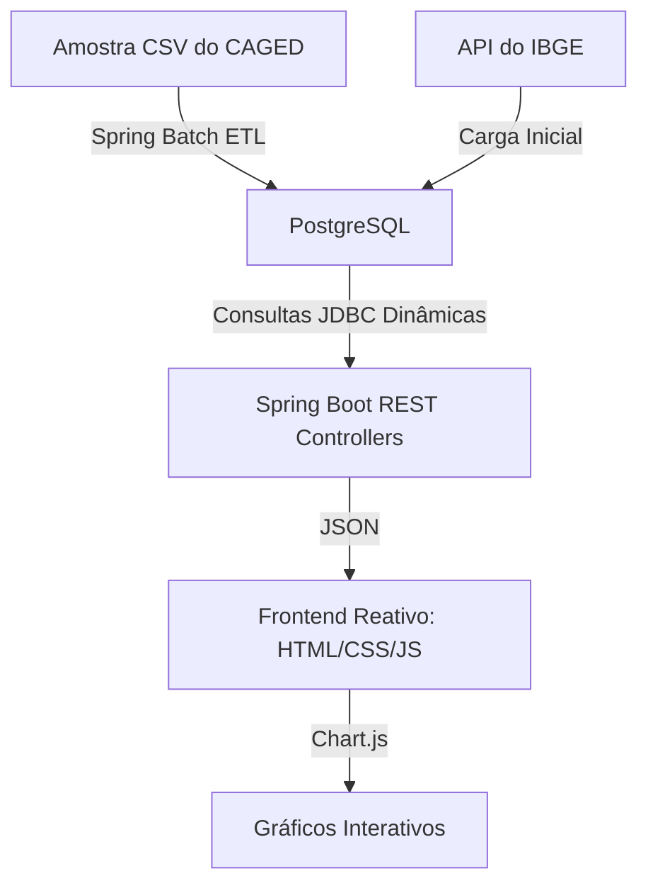

# 📊 Mercado Tech Brasil — Inteligência sobre Contratações de TI no Novo CAGED

O **Mercado Tech Brasil** é uma plataforma analítica desenvolvida para traduzir a complexidade de milhões de microdados oficiais do governo federal (Novo CAGED) em respostas claras sobre o mercado de tecnologia no Brasil. 

O projeto combina uma arquitetura robusta de engenharia de dados em Java/Spring Batch com uma interface de visualização interativa, responsiva e acessível (com suporte nativo a temas escuro e claro).

---

## 💡 O "Porquê" do Projeto 

No setor de tecnologia, a tomada de decisão sobre salários e contratações frequentemente baseia-se em pesquisas informais ou estimativas superficiais. O objetivo do **Mercado Tech Brasil** é trazer **dados reais e oficiais** para o debate. Ele foi criado para responder a perguntas reais de líderes de engenharia, recrutadores e profissionais de TI:

* *Quanto realmente ganha um programador Júnior em São Paulo vs no Sul do país?*
* *Quais estados brasileiros estão contratando mais profissionais de TI de forma consolidada?*
* *Qual é a real amplitude salarial por cargo e nível de senioridade no mercado CLT formal?*

Ao extrair e limpar registros governamentais brutos, a plataforma empodera profissionais a negociar melhor e ajuda empresas a planejar sua atração e retenção de talentos com base em fatos, não em palpites.

---

## 🚀 Principais Insights do Dashboard (2024)

Com a importação e o processamento de mais de **411 mil registros** de contratações e desligamentos reais em 2024, identificamos padrões marcantes:

* **Soberania do Eixo SP**: O estado de São Paulo lidera absoluto na absorção de talentos de TI, respondendo por mais da metade das vagas geradas no país.
* **Teto da Engenharia**: Os cargos de *Engenheiro de Computação* e *Engenheiro de Aplicativos* apresentam a maior valorização salarial média nacional, superando frequentemente a marca dos **R$ 15.000,00**.
* **Diferença de Níveis (Senioridades)**: A amplitude de salários é evidente. Para *Analistas de Sistemas*, a faixa de entrada (Júnior - Percentil 25) gira em torno de R$ 4.500,00, enquanto a faixa alta (Sênior - Percentil 75) atinge R$ 11.200,00 no estado de São Paulo, evidenciando o retorno da qualificação profissional no país.

---

## 🛠️ Arquitetura e Engenharia de Dados

A arquitetura do projeto foi desenhada para suportar alto volume de processamento de forma resiliente, limpa e com baixo consumo de memória:



### 1. Processamento em Lote (ETL com Spring Batch)
* **Job Configurado**: `admissoesJob` executa a leitura, filtragem de dados de tecnologia e inserção no banco em lotes (*chunks*) de 10.000 linhas.
* **Resiliência**: Processa **411.740 linhas** brutas em menos de 4 minutos, limpando inconsistências e rejeitando apenas linhas inválidas (ex: sem município ou código CBO).
* **Flyway**: Gerencia as migrações do banco de dados relacional (criação de tabelas, índices de performance e sementes iniciais).

### 2. Classificação de Senioridade sem Adivinhação (Percentis)
A base bruta do CAGED não contém campos de senioridade. Para resolver isso com robustez estatística de mercado, utilizamos funções analíticas de **Percentis do PostgreSQL**:
* **Júnior**: Percentil 25 (25% menores salários) -> `percentile_cont(0.25)`
* **Pleno**: Percentil 50 (Mediana salarial) -> `percentile_cont(0.50)`
* **Sênior**: Percentil 75 (25% maiores salários) -> `percentile_cont(0.75)`

Isso garante uma representação fidedigna das faixas salariais praticadas em cada ocupação e região.

### 3. Frontend Reativo e Acessível (Princípios RCD)
* **Visualização Premium**: Dashboard desenhado sob as premissas de *Revenue-Centric Design*, minimizando fricção e entregando valor imediato (*Value first, ask later*).
* **Alternador de Temas**: Suporta **Modo Escuro (Dark Mode)** e **Modo Claro (Light Mode)** com transições suaves e persistência no `localStorage`.
* **Filtros Dinâmicos**: Dropdowns de UF, Cargo e Senioridade que redesenham os gráficos instantaneamente em nível de cliente.

---

## 📦 Tecnologias Utilizadas

* **Backend**: Java 17, Spring Boot 3.x, Spring Batch, Spring Data JPA, Spring JDBC (JdbcTemplate).
* **Banco de Dados**: PostgreSQL 16 (via Docker).
* **Migrações**: Flyway Migration.
* **Frontend**: HTML5, Vanilla CSS, JavaScript (ES6+), Chart.js (gráficos interativos).

---

## 🚀 Como Rodar o Projeto Localmente

### Pré-requisitos
* **Java JDK 17** ou superior instalado.
* **Maven 3.x** configurado.
* **Docker** e **Docker Compose** rodando na máquina.

### Passo 1: Subir o Banco de Dados (PostgreSQL)
Na raiz do projeto, execute o Docker Compose para iniciar o banco de dados configurado na porta `5433`:
```bash
docker-compose up -d
```

### Passo 2: Executar a Aplicação Spring Boot
Utilize o wrapper do Maven para compilar e iniciar o servidor do Spring Boot:
```bash
./mvnw spring-boot:run
```

Aguarde até o log indicar a inicialização bem-sucedida: `Started MercadoTechApplication in...`. Durante o boot, o sistema buscará automaticamente a API oficial do IBGE para cadastrar os 5.570 municípios do Brasil e os códigos oficiais das ocupações de tecnologia da CBO.

### Passo 3: Acessar a Interface e Rodar o ETL
1. Abra o seu navegador em: **[http://localhost:8080/](http://localhost:8080/)**
2. Coloque a amostra CSV de dados baixada da Base dos Dados em `src/main/resources/data/amostra_caged.csv`.
3. Clique em **Disparar Carga ETL** no painel de controle. O processamento iniciará em background e você poderá acompanhar o progresso (linhas lidas, processadas e rejeitadas) na interface em tempo real.
4. Ao finalizar, utilize os filtros de **Estado (UF)**, **Cargo** e **Senioridade** para explorar e interagir com os dados!
